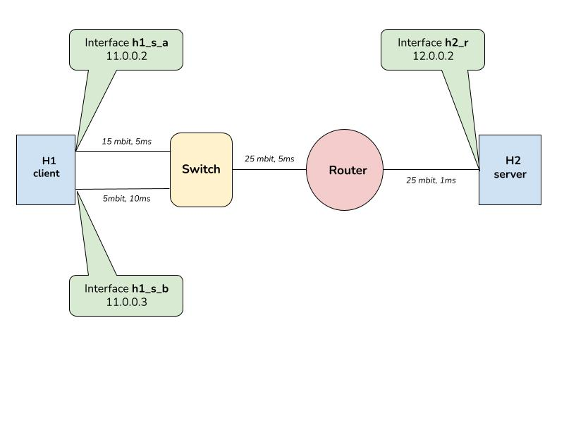

# MPTCP on network namespaces

## Dependencies

- Tool to convert legacy tcp socket creation to mptcp. Eg: [mptcpd](https://github.com/intel/mptcpd/releases/download/v0.9/mptcpd-0.9.tar.gz) or [use_mptcp](https://github.com/pabeni/mptcp-tools/tree/master/use_mptcp)

```bash
sudo apt install iperf3 wireguard
```

## Usage

```bash
sudo ./start.sh
```

## Testing with iperf

- Server
```bash
sudo ip netns e h2 mptcpize run iperf3 -s
```

- Client
```bash
sudo ip netns e h1 mptcpize run iperf3 -c 10.0.0.1
```


## Topology


- Host `h1` with 2 interfaces is connected to switch `s`.
- `s` is connected to router `r`.
- `r` is connected to host `h2` (which hosts the wireguard server)
 

